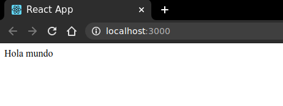

# Hola mundo:

### Para iniciar, tiendo node y npm instalados. Con herramientas listas.

- Paso 1

Usar create-react-app ("CRA") para generar un nuevo proyecto. CRA creará un directorio e instalará todos los paquetes necesarios, y luego ingresar a ese nuevo directorio.

```shell
$ npx create-react-app react-hello

$ cd react-hello
```

El proyecto generado viene con template de demostración preconstruida. Vamos a eliminar eso y comenzar de nuevo. Eliminar los archivos del directorio src y crear un nuevo archivo index.js vacío.

```shell
$ rm src/*

$ touch src/index.js
```

- Paso 2

Abrir el nuevo archivo src/index.js y escribir (no copy-paste) el código:

```js
import React from "react";
import ReactDOM from "react-dom";

function HelloWorld(params) {
    return(
        <div>Hola mundo</div>
    )
}

ReactDOM.render(
    <HelloWorld/>,
    document.querySelector('#root')
)
```

Las declaraciones de importación en la parte superior son una característica de ES6. Estas líneas estarán en la parte superior de cada archivo .js que vemos usando react.

A diferencia de ES5, no podemos simplemente incluir una etiqueta < script > y obtener React como un objeto global. Entonces, la instrucción *import React from 'react'* crea una nueva variable llamada React con el contenido del módulo react.

Las cadenas "react" y "react-dom" son importantes: corresponden a los nombres de los módulos instalados por npm para poder usar la libreria.

- Paso 3

Dentro del directorio react-hello, iniciar la aplicación ejecutando el comando:

```shell
$ npm start
```

ó tambien si se tiene yarn instalado

```shell
$ yarn start
```

Entonces el navegador por defecto se abrirá automáticamente y mostrará "¡Hola Mundo!"



### - Cómo funciona el código

Comenzando desde abajo, con la llamada a *ReactDOM.render*. Eso es lo que realmente hace que esto funcione.

Este fragmento de código es JavaScript normal, a pesar de lo que parece < HelloWorld /> en HTML. Si se intenta comentar esa línea y mira cómo desaparece Hello World.

React utiliza el concepto de un DOM virtual. Crea una representación de la jerarquía de sus componentes y luego los representa creando elementos DOM reales e insertándolos donde se indique. En este caso, eso está dentro del elemento con id *root*.

*ReactDOM.render* toma 2 argumentos: lo que desea renderizar (componente personalizado o cualquier otro Elemento React) y dónde se desea renderizarlo (un elemento DOM real que ya existe).

```js
ReactDOM.render([React Element], [DOM element]);
```

Por encima de eso, tenemos un componente llamado *HelloWorld*. La forma principal de escribir componentes React es como funciones simples como esta. La mayoría de las personas los llaman "componentes funcion", pero también pueden verse llamados "componentes funcionales" o "componentes funcionales sin estado" (SFC para abreviar).

Hay otras dos formas de crear componentes: las clases de ES6 y React.createClass pero deprecado o considerado obsoleto.

Aún puede verse el estilo createClass en proyectos antiguos o respuestas de Stack Overflow, pero ya no es de uso común. Principalmente ahora se busca escribir componentes como funciones.

*La sintaxis similar a HTML dentro de la función de render se llama JSX.*