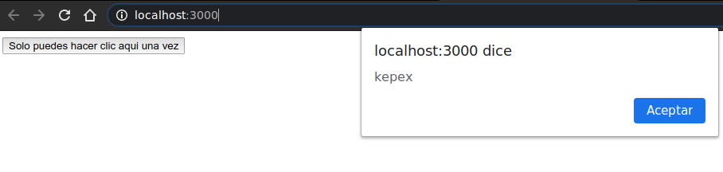

# El useState Hook

Con un nuevo ejemplo. Se comenzará con una clase y luego se cambiará a una función que use el hook useState para conservar el estado.

Será con un componente de "button" al que solo se puede hacer clic una vez. Una vez que hace clic en él, el estado en el que se hizo clic se vuelve verdadero y el botón se deshabilita.

Crear un nuevo proyecto llamado "usestate" y comenzar con un index.js en blanco

```shell
$ npx create-react-app usestate
$ cd usestate
$ rm src/*
$ touch src/index.js
```

Abrir src/index.js, iniciar el proyecto con npm start y escribir en el archivo:

```js
import React from 'react';
import ReactDOM from 'react-dom';

class OneTimeButton extends React.Component {
    state={
        clicked: false
    }

    handleClick=() => {
        // No se llamará al controlador si el botón
        // está deshabilitado, así que si llega aquí, es seguro
        // para activar el clic.
        this.props.onClick();
        // Ok, no más clics.
        this.setState({ clicked: true });
    }

    render() {
        return (
            <button
                onClick={this.handleClick}
                disabled={this.state.clicked}
            >
            Solo puedes hacer clic aqui una vez
            </button>
        );
    }

}

ReactDOM.render(
    <OneTimeButton onClick={() => alert("kepex")} />,
    document.querySelector('#root')
);
```

El botón debería deshabilitarse tan pronto como haga clic en él, y solo debería ver la alerta "kepex" una vez.



Ahora, convertirlo en un componente de función:

```js
function OneTimeButton({ onClick }) {
    const [clicked, setClicked]=React.useState(false);

    const handleClick=() => {
        onClick();
        // Ok, no más clics.
        setClicked(true);
    };

    return (
        <button 
        onClick={handleClick} 
        disabled={clicked} 
        >
        Solo puedes hacer clic aqui una vez
        </button>
    );
}
```

Se movio la función del controlador hacia adentro y se cambio un par de referencias. Por lo que se puede acceder directamente a la prop onClick, así como a la función handleClick, ya que todo está dentro del mismo alcance (scope).

El cambio significativo es la introducción de *React.useState* y las variables clicked / setClicked para asignar los valores iniciales.

useState es un hook. Puede saberse porque su nombre comienza con "use" (esa es una de las Reglas de Hooks; sus nombres deben comenzar con "use").

El hook useState toma el estado inicial como un argumento (se pasa false) y devuelve un array con 2 elementos: el estado actual (*clicked*) y una función para cambiar el estado (*setClicked*).

Los componentes de Clase tienen un objeto de estado grande y una función *this.setState* para cambiar todo de una vez (además, fusiona el nuevo valor de forma superficial).

Los componentes de función no tienen ningún estado, pero el hook useState permite agregar pequeñas piezas de state a medida que se necesite. Entonces, si en el ejemplo anterior todo lo que se necesita es solo un booleano, se puede crear parte de estado para mantenerlo.

Dado que se esta creando estos elementos de estado de una manera con proposito definido, y no existe una función setState para todo el componente, tiene sentido que se necesite una función para actualizar cada elemento del estado. Entonces el retorno de **React.useState()** es un par: *valor*, *función*.

Cada useState puede almacenar un valor, y el valor puede ser cualquier tipo JS: número, booleano, objeto, matriz, etc.

La sintaxis de corchetes **[clicked, setClicked]** = ... a la izquierda del signo igual es la desestructuración de la matriz, es solo JS/ES6+ (no es algo especial de hooks). Funciona de manera similar a la desestructuración de objetos vista con anterioridad, excepto que debido a que los elementos del array no tienen nombres, se puede asignar nombres personalizados a los elementos cuando se desestructuran.

Con useState es común nombrar los valores devueltos como **nombrex** y **setNombrex**, pero pueden nombrarse como se quiera.

Entonces ahora será de interes saber la respuesta a los siguientes planteamientos:

• Cómo sabe React cuál era el estado anterior? Cuando el componente se vuelve a representar... no se volverá a crear el estado cada vez?

• Cómo puedo almacenar un estado más complejo? Tengo que hacer un seguimiento de más de un valor?

• Por qué los nombres de hooks tienen que comenzar obligatoriamente con "use"?

• Si hay regla sobre los nombres... significa que puedo hacer hook propios personalizados?