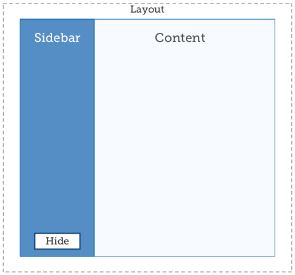

# Dónde mantener el estado

Siempre que se pueda, lo mejor es mantener los componentes sin estado. Los componentes sin estado son más fáciles de escribir y más fáciles de razonar. A veces esto no es posible, pero a menudo, los datos que inicialmente se piensan que deberían ir en el estado interno se pueden elevar al componente principal, o incluso más.

Imaginar una sección de página que se puede mostrar u ocultar, como una barra lateral:



Cuando se hace clic en el botón "Ocultar", la barra lateral debería desaparecer, lo que significa que algo debe establecer un indicador showSidebar en falso. Este indicador debe almacenarse en el estado en algún lugar. ¿Pero donde?

Opción 1, el indicador showSidebar podría residir en el componente Sidebar. De esta manera, la barra lateral "sabe" si está abierta o no. Esto es similar a cómo funcionan las entradas no controladas.

Opción 2, el indicador showSidebar puede residir en el elemento padre de Sidebar, que es el componente Layout. Entonces el padre puede decidir si renderiza la barra lateral o no:

```js
class Layout extends React.Component {
    state = {
        showSidebar: false
    }

    toggleSidebar = () => {
        this .setState({
            showSidebar: !this.state.showSidebar
        });
    } 

    render() {
        const { showSidebar } = this.state;
        return (
        <div className="layout" >
            {showSidebar &&
            <Sidebar
            onHide={this.toggleSidebar} >
            algún contenido de la barra lateral
            </Sidebar> }
            <Content
            isSidebarVisible={showSidebar}
            onShowSidebar={ this.toggleSidebar} >
            algún contenido aquí
            </Content>
        </div>
        );
    }
}

const Content = ({
    children,
    isSidebarVisible,
    onShowSidebar
    }) => (
        <div className="content" >
        {children}
        {!isSidebarVisible && (
            <button onClick={onShowSidebar} > Show </button>
        )}
        </div>
);

const Sidebar = ({
    onHide,
    children
    }) => (
        <div className="sidebar" >
        {children}
        <button onClick={onHide} > Hide </button>
        </div>
);
```

De esta manera, Sidebar no "sabe" internamente si es visible. Se represente o no se represente.

Mantener el estado en un componente padre puede parecer antinatural. A primera vista, incluso podría parecer que esto haría que Sidebar sea difícil de reutilizar, ya que debe pasarse una función de devolución de llamada a la que Sidebar pueda llamar cuando necesite ocultarse.

Por el contrario, tener menos componentes que contengan estado significa menos lugares para buscar cuando aparece un error. Y si se necesita hacer algo con ese estado, como guardarlo en localStorage para persistir en las recargas de la página, la lógica solo debe existir en un componente. Menos código duplicado significa menos tiempo para rastrear errores y menos tiempo para mantener todos los duplicados sincronizados.