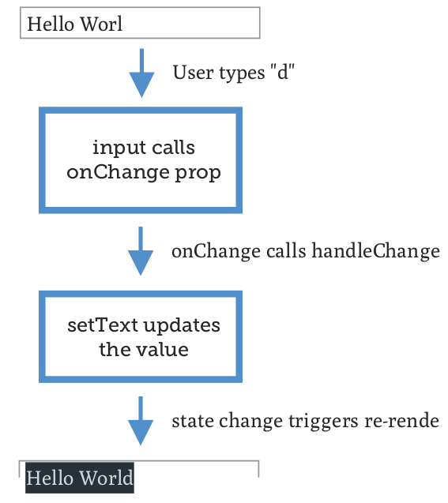

# Entradas controladas

La razón por la que se les llama "controladas" es porque el usuario es responsable de controlar su estado. Debe pasar un valor y mantener ese valor actualizado a medida que el usuario escribe. Es un poco más de trabajoso, pero después de escribir muchos de ellos será natural.

En lugar del enlace bidireccional "mágico" (2-way binding) que tienen algunos frameworks, React hace las cosas explícitas. Así es como se ve una entrada controlada:

```js
import React, { useState } from 'react';

const InputExample = () => {
    const [text, setText] = useState('');
    
    const handleChange = event => {
        setText(event.target.value);
    };
    
    return (
        <input
        type="text"
        value={text}
        onChange={handleChange}
        />
    );
}
```

En la parte superior de la función, se crea un estado para mantener el valor de la entrada y almacenarlo en *text*.

Luego está la función *handleChange*, actualiza *text* con el valor desde el evento. Se pasa como la prop onChange de la entrada, por lo que cada vez que se presiona una tecla, se llamará a la función *handleChange* con el valor actual de la entrada (todo, no solo la tecla más reciente).

También se esta pasando una prop *value* a la entrada, indicando de manera efectiva qué mostrar.

Imaginando que se tiene una entrada con el texto "Hola Mund" (sin la "o"), la secuencia de eventos que sucede cuando se escribe la letra final:



Ahora, tal vez se crea que parece ser mucho código para una entrada simple. Quiza, pero este método proporciona mucha utilidad.

Del ejemplo anterior, intentar eliminar o comentar la llamada a setText, luego intentar escribir en el cuadro de texto. Se esperaria, que no sucede nada porque el valor está fijo en el valor inicial.

Ahora, ¿qué sucede si se ignora por completo los datos del evento?

Intentar cambiar setText para ignorar los datos del evento y, en su lugar, siempre establecer el texto con el mismo valor, de esta manera:

```js
import React, { useState } from 'react';

const TrickInput = () => {
    const [text, setText] = useState(
        'intentar escribir algo'
    );
    
    const handleChange = event => {
        setText('haha nada papu');
    };

    return (
        <input
        type="text"
        value={text}
        onChange={handleChange}
        />
    );
}
```

Se verá que la entrada impide los intentos de cambiarlo.

Esta técnica es útil si se necesita hacer algún tipo de validación o formato personalizado, porque puede hacerse ambas cosas en la función handleChange. No se quiere que el usuario escriba números? Eliminar los números antes de actualizar el estado:

```js
const NoNumbersInput = () => {
    // ...
    const handleChange = event => {
        let text = event.target.value;
        setText(
            text.replace(/[0-9]/g, '')
        );
        };
        // ...
    }
```

Intentar escribir algunos números en el cuadro de texto. Intentar pegar una cadena que contenga números. Sin comportamiento extraño.

Y asi se puede formatear la entrada valida de cosas como un número de teléfono, número de tarjeta de crédito, o hacer cambios en respuesta a la posición del cursor.

Pero tal vez no importe todo eso. Si solo se desea que la entrada administre su propio estado. Las entradas no controladas lo harán, con algunas advertencias.