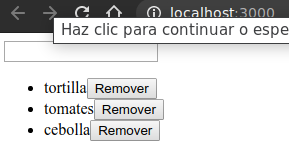

# Un ejemplo más practico

Ejemplo con un reductor que hace un poco más. Crear un componente para administrar una lista de compras.

Crear un nuevo proyecto si se desea, o reutilizar de ejemplos anteriores.

Por si acaso nuevo:
```shell
npx create-react-app usereducer

rm src/*
touch src/index.js
```

Y de esto, primero se necesita importar dos hooks:

```js
import React, { useReducer, useRef } from 'react';
```

Luego, crear un componente que configure una referencia (ref) y un reductor (reducer). La ref tendrá una referencia a una entrada de formulario, para poder extraer su valor. (También se podría administrar la entrada con el estado, pasando las prop de value y onChange como de costumbre, pero esta es la oportunidad para mostrar el hook useRef y ahorrar algunas líneas de código)

```js
import React, { useReducer, useRef } from 'react';
import ReactDOM from 'react-dom';

const reducer=(state, action) => {
    switch (action.type) {
        // hacer algo con la acción
    }
};

function ShoppingList() {
    const inputRef=useRef();
    const [items, dispatch]=useReducer(reducer, []);
    
    return (
        <>
            <form onSubmit={handleSubmit} >
                <input ref={inputRef} />
            </form>
            <ul>
                {items.map((item, index) => (
                    <li key={item.id} >
                        {item.name}
                    </li>
                ))}
            </ul>
        </>
    );
}

ReactDOM.render(
    <ShoppingList />,
    document.querySelector('#root')
);
```

El "state" en este caso es un array. Se esta inicializando en un array vacío (el segundo argumento para useReducer) y devolverá un array de la función reductora.

También se esta escribiendo la función reductora (reducer) fuera del componente. No tiene que hacerse de esta manera; en su lugar, puede escribirse en línea y pasarlo a useReducer directamente. Pero colocar fuera del componente deja en claro que no debería depender de partes de state o props. Cualquier valor que necesite el reductor debe pasarse como parte de una acción. El otro beneficio de escribir el reductor fuera del componente es que puede ser más fácil de reutilizar.

Se ha ajustado la entrada (input) con un formulario para que al presionar *Enter* se active la función de envío. Ahora se necesita escribir la función *handleSubmit* que agregará un elemento a la lista, y se necesita manejar la acción en el reductor.

```js
//...

const reducer=(state, action) => {
    switch (action.type) {
        // +
        case 'add':
            return [
                ...state,
                {
                    id: state.length,
                    name: action.name
                }
            ];
        default:
            return state;
    }
};

function ShoppingList() {
    const inputRef=useRef();
    const [items, dispatch]=useReducer(reducer, []);

    // +
    function handleSubmit(e) {
        e.preventDefault();
        dispatch({
            type: 'add',
            name: inputRef.current.value
        });
        inputRef.current.value='';
    }    

    return (
        <>
            <form onSubmit={handleSubmit} >
                <input ref={inputRef} />
            </form>
            <ul>
                {items.map((item, index) => (
                    <li key={item.id} >
                        {item.name}
                    </li>
                ))}
            </ul>
        </>
    );
}

//...
```

Se ha completado la función reducer con dos casos: uno para cuando la acción (action) tiene type === 'add', y el caso predeterminado para todo lo demás.

Cuando el reducer obtiene action "add", devuelve un nuevo array que incluye todos los elementos antiguos, más el nuevo elemento al final.

Se esta utilizando la longitud del array como una especie de ID de incremento automático (ish). Esto funciona para el propósito de aquí, pero no es buena idea para una aplicación real porque podría generarse ID duplicados y errores. (mejor usar una libreria como [*uuid*](https://www.npmjs.com/package/uuid) o dejar que el servidor del backend genere una ID única)

Se llama a la función handleSubmit cuando el usuario presiona Enter en el cuadro de texto del input, por lo que se debe llamar a *preventDefault* para evitar una recarga de página completa cuando eso suceda. Luego llamar dispatch con una acción. En esta aplicación, se esta decidiendo dar a las acciones una forma más Redux-y: un objeto con una propiedad *type* y algunos datos asociados. También se esta limpiando la entrada.

## Eliminar un elemento

Ahora se agregará la posibilidad de eliminar un elemento de la lista.

Agregar un < button > "eliminar" al lado del elemento, que enviará una acción con *type === "remove"* y el índice del elemento a eliminar.

Luego solo se tendrá que manejar esa acción en el reductor, lo que se hará será filtrar el array para eliminar el elemento presionado.

```js
//...

const reducer=(state, action) => {
    switch (action.type) {
        case 'add':
            return [
                ...state,
                {
                    id: state.length,
                    name: action.name
                }
            ];
        // +
        case 'remove':
            // mantener todos los elementos excepto el que se quiere eliminar
            return state.filter((_, index) => index !== action.index);            
        default:
            return state;
    }
};

function ShoppingList() {
    const inputRef=useRef();
    const [items, dispatch]=useReducer(reducer, []);

    function handleSubmit(e) {
        e.preventDefault();
        dispatch({
            type: 'add',
            name: inputRef.current.value
        });
        inputRef.current.value='';
    }    

    return (
        <>
            <form onSubmit={handleSubmit} >
                <input ref={inputRef} />
            </form>
            <ul>
                {items.map((item, index) => (
                    <li key={item.id} >
                        {item.name}
                        {/* + */}
                        <button
                            onClick={() => dispatch({ type: 'remove', index })}
                        >
                        Remover
                        </button>                        
                    </li>
                ))}
            </ul>
        </>
    );
}

//...

```

Y se renderizaría con el comportamiento esperado.

