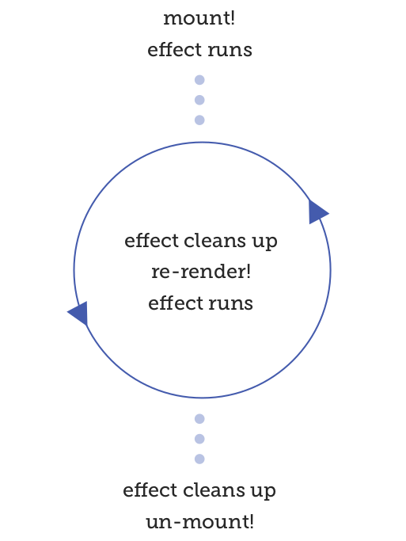

# Solo ejecución en montaje y desmontaje

Como se ha visto, si no se pasa ningun array, se le está diciendo a useEffect que se ejecute en cada render. ¿Qué sucede si se pasa un array vacio []?

El array vacio dice "este efecto no depende de nada", por lo que solo se ejecutará una vez, después del primer render.

Entonces, si se cambia en el componente de ejemplo anterior sobre limite effect, para llamar a useEffect de esta manera:

```js
useEffect(() => {
    console.log('mounted');
    return () => console.log('unmounting...');
}, []) // <-- agregar este array vacio aquí
```

Luego imprimirá "montado" después del renderizado inicial, permanecerá en silencio durante toda su vida e imprimirá "desmontando ..." al salir.

Sin embargo, esto viene con una advertencia: pasar el array vacio es propenso a errores. Es fácil olvidar agregarle un elemento si se agrega una dependencia, y si se omite una dependencia, ese valor quedará obsoleto la próxima vez que se ejectue useEffect y podría causarse algunos problemas extraños. Solo asegurarse de que cuando se indique un array vacio [], realmente se diga en serio.

## Desmontaje y limpieza

En ese anterior ejemplo, se esta devolviendo una función del efecto, y se llamará a esa función para limpiar el efecto.

No todos los efectos tendrán que limpiarse por sí mismos, pero algunos sí. Los efectos que inician un temporizador o intervalo, o inician una solicitud que debe cancelarse, o agregan un detector de eventos que debe eliminarse, todos son ejemplos de momentos en los que se querrá devolver la función de limpieza.

La limpieza siempre ocurre cuando el componente está desmontado, y también sucederá cada vez que se ejecute el efecto. Eso es útil si, por ejemplo, se desea suscribir a algunos eventos basados en alguna prop, pero luego volver a suscribirse cuando esa prop cambie:

```js
useEffect(() => {
    // en montaje, y cada vez que blogPostId
    // cambie, establecer una suscripción
    subscribeToNewComments(blogPostId);

    // al desmontar, y cada vez *antes*
    // suscribirse de nuevo, desuscribirse de
    // el último blogPostId
    return () => unsubscribeFromComments(blogPostId);
    }, [blogPostId])
```

Esta es una buena y limpia forma de mantener las suscripciones sincronizadas con un determinado dato.

Puede pensarse que hay un error, que se desuscribira el nuevo blogPostId. Pero eso no es lo que sucede, porque la función que se devuelve es un cierre (closure) que se aferra al valor de blogPostId en el momento en que se crea.

Si, durante la primera vez a través de este efecto, el blogPostId es 42, se suscribirá simultáneamente a los comentarios para la publicación 42 y devolverá una función que luego podrá desuscribirse de los comentarios para la publicación 42. La función devuelta conserva el valor 42

Así es como funciona el "ciclo de efectos", entre el renderizado inicial, los renders posteriores y finalmente el desmontaje:



