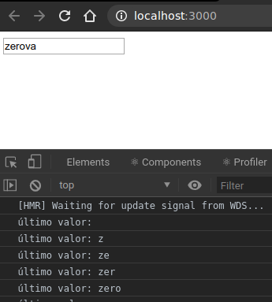

# Intro useEffect

Se ha visto cómo agregar métodos de ciclo de vida a los componentes de clase que permiten "hacer que las cosas sucedan" en momentos específicos, por ejemplo, después de que un componente se monte o después de que se vuelva a representar.

El nombre genérico para estas acciones es "efectos secundarios", un término que proviene de la programación funcional. En un mundo ideal, podría implementarse interfaz de usuario como una función pura de props y state: dado un conjunto específico de state, que la aplicación debería verse así. Esa es la idea central detrás de React, y funciona bien la mayor parte del tiempo.

Sin embargo, a veces, debe hacerse algo que no encaja dentro de ese cuadro. Podría estarse iniciando una solicitud para obtener datos o enfocandose un control de entrada cuando se carga la página. Básicamente, cualquier cosa que no se ajuste al paradigma de las actualizaciones con state puede ser manejada por un efecto secundario.

Con el hook useEffect, puede responderse a los eventos del ciclo de vida directamente dentro de los componentes de función. A saber, tres de ellos: componentDidMount, componentDidUpdate y componentWillUnmount. Todo con una sola función.

Cada cambio en las props o el state hará que un componente se vuelva a representar. En cada render, useEffect tendrá la oportunidad de ejecutarse. De forma predeterminada, sus efectos se ejecutarán en cada renderizado, pero se verá cómo limitar la frecuencia con la que se ejecutan.

Pensar en useEffect como "sí-esto-entonces-eso" para los componentes React.

Crear un proyecto para poder jugar con useEffect. Dejar vacío src y abrir un nuevo archivo index.js.

```shell
$ npx create-react-app useeffect-hook
$ cd useeffect-hook
$ rm src/*
$ touch src/index.js
```

Luego escribir este ejemplo:

```js
import React, { useState, useEffect } from 'react';
import ReactDOM from 'react-dom';

const LogEffect=() => {
    const [text, setText]=useState('');

    useEffect(() => {
        console.log('último valor:', text);
    });

    return (
        <input
            value={text}
            onChange={e => setText(e.target.value)}
        />
    );
};

ReactDOM.render(
    <LogEffect />,
    document.querySelector('#root')
)
```

Iniciar el ejemplo con *npm start* y abrir la consola. Se verá que la aplicación registró el "último valor", aunque no se haya escrito nada en el cuadro de texto. Esto se debe a que *useEffect* se ejecuta después del renderizado inicial. Siempre se ejecuta después del renderizado inicial, y no hay forma de desactivarlo. (Esto es similar a componentDidMount)

Ahora intentar escribir en el cuadro de texto y se verá que registra un mensaje para cada carácter que se escriba. Esto se debe a que el efecto se ejecuta después de cada render.

