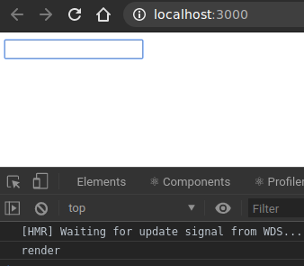

# Límite cuando se ejecuta un Effect

A veces, solo se querrá que se ejecute un efecto en respuesta a un cambio específico. Tal vez cuando el valor de una prop cambia o se produce un cambio en el state. Para eso es el segundo argumento de *useEffect*: es una lista de *dependencias*.

Aquí un ejemplo que trata de: "Si la prop blogPostId cambia, descargar esa publicación de blog y mostrarla":

```js
useEffect(() => {
    fetch(`${config.url}/posts/${blogPostId}`)
    .then(content =>
    setContent(content)
    )
}, [blogPostId])
```

En este: "Si el nombre de usuario cambia, guardar en localStorage":

```js
useEffect(() => {
    localStorage.setItem('username', username)
}, [username])
```

En este indica: "Tan pronto como el usuario ingrese la contraseña correcta, mostrar el secreto":

```js
useEffect(() => {
    if (passcode === '1234') {
        setShowSecret(true);
    }
}, [passcode])
```

Se observa cómo ese código continuará mostrando el secreto incluso si el usuario cambia la contraseña? Funciona como desbloquear una caja fuerte. Si escriben "1234", aparecerá el secreto. Si luego presionan la tecla de retroceso y la cambian a "123", el secreto aún se mostrará pues ya se cumplio la condición.

Comparar eso con esta versión, que ocultaría el secreto si cambiaran el código de acceso de "1234" a cualquier otra cosa:

```js
useEffect(() => {
    setShowSecret(passcode === '1234');
}, [passcode])
```

La similitud clave con todos estos ejemplos es que incluyen el conjunto de dependencias como segundo argumento. Este array debe contener todos los valores que, si cambian, deberían hacer que el efecto se recalcule.

## Enfocando entrada automáticamente

Se verá cómo poder enfocar un control de entrada en el primer renderizado, usando *useEffect* combinado con el hook *useRef*.

```js
import React, { useState, useEffect, useRef } from 'react';
import ReactDOM from 'react-dom';

function App() {
    // Almacenar una referencia al nodo DOM del input
    const inputRef=useRef();

    // Almacenar el valor del input en el state
    const [value, setValue]=useState("");

    useEffect(
        () => {
            // Esto se ejecuta DESPUÉS del primer render, 
            // por lo que la referencia ya está establecida.
            console.log("render");
            inputRef.current.focus();
        },
        // El efecto "depende de" inputRef
        [inputRef]
    );

    return (
        <input
            ref={inputRef}
            value={value}
            onChange={e => setValue(e.target.value)}
        />
    );
}

ReactDOM.render(
    <App />,
    document.querySelector('#root')
)
```

En la parte superior, se esta creando una referencia vacía con useRef. Pasando a la prop de *ref* de la entrada se encarga de configurarlo una vez que se renderiza el DOM. Y, lo que es más importante, el valor devuelto por *useRef* será estable entre los renders.

Entonces, aunque se este pasando [inputRef] como el segundo argumento de *useEffect*, efectivamente solo se ejecutará una vez, justo después de que se monte el componente. Esto es básicamente "componentDidMount" (excepto el momento preciso del mismo).

Si se prueba escribiendo el ejemplo. Observar que la entrada se enfoca automáticamente en la carga de la página. Luego intentar escribir en el cuadro de texto. Cada caracter desencadena un re-render, pero si se mira la consola, se verá que "render" solo se imprime una vez. UseEffect está mirando el valor de inputRef cada vez, viendo que no ha cambiado desde el render anterior, y luego decide no ejecutar su función de efecto.



Otra forma de pensar en este array de dependencias es: debe contener todas las variables que la función de efecto utiliza desde el alcance circundante. Entonces, si se usa una prop? Eso va en ese array. Si se usa un parte del state? Eso va en ese array.