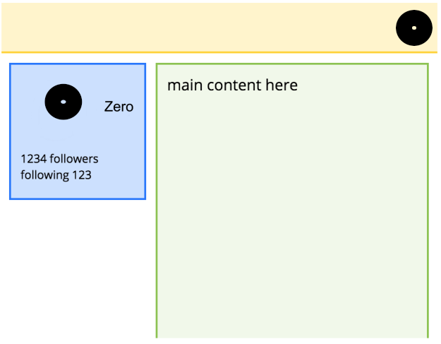
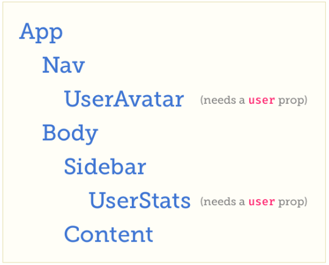

# Ejemplo perforación de props

Se verá un ejemplo. Comenzando con una versión simple de aplicación React (sin contexto) y luego se agregará Context para ver cómo ayuda.



Esta aplicación muestra la información del usuario en dos lugares: en la barra de navegación en la esquina superior derecha y en la barra lateral al lado del contenido principal.

La estructura de componentes se veria así:



Se necesita almacenar información del usuario lo suficientemente alto en el árbol para que pueda transmitirse a los componentes que la necesitan. Los datos deben mantenerse al menos un nivel por encima de todos los componentes que necesitan acceso a ellos. En este caso, el guardián de la información del usuario debe ser App.

Para que la información del usuario llegue a los componentes que la necesitan, la aplicación debe pasarla a Nav y Body. Ellos, a su vez, deben pasarlo de nuevo a UserAvatar y a Sidebar. Finalmente, Sidebar tiene que pasarlo a UserStats.

Cómo se veria esto en código:

```js
import React from 'react';
import ReactDOM from 'react-dom';
import './index.css';

const UserAvatar = ({ user, size }) => (
    
);

const UserStats = ({ user }) => (
    <div className="user-stats" >
        <div>
            <UserAvatar user={user} />
            {user.name}
        </div>
        <div className="stats" >
            <div> {user.followers} Followers </div>
            <div> Following {user.following} </div>
        </div>
    </div>
);

const Nav = ({ user }) => (
    <div className="nav" >
        <UserAvatar user={user} size="small" />
    </div>
);

const Content = () => (
    <div className="content" > main content here </div>
);

const Sidebar = ({ user }) => (
    <div className="sidebar" >
        <UserStats user={user} />
    </div>
);

const Body = ({ user }) => (
    <div className="body" >
        <Sidebar user={user} />
        <Content user={user} />
    </div>
);

class App extends React.Component {
    state = {
        user: {
            avatar: 'https://www.gravatar.com/avatar/763dcd4dad38689d57aa9d83a60bfaa5',
            name: 'Zero',
            followers: 1234,
            following: 123
        }
    };
    
    render() {
        const { user } = this.state;

        return (
            <div className="app" >
                <Nav user={user} />
                <Body user={user} />
            </div>
        );
    }
}

ReactDOM.render(
    <App />,
    document.querySelector('#root')
);
```

Aquí, App inicializa el estado para contener el objeto "user" como datos estáticos. En una aplicación real, estos datos pueden provenir de un servidor. (Y, el componente App podría escribirse fácilmente con hooks y useState).

Con esto la "perforación de props" no se desalienta de ninguna manera; es un patrón perfectamente válido y el núcleo de la forma en que funciona React. Pero la perforación profunda puede ser un poco molesta de escribir, y la molestia se amplifica cuando se tiene que pasar muchas props en lugar de solo una.

Hay una desventaja más grande en esta estrategia de perforación de props: crea un acoplamiento entre componentes que de otro modo se desacoplarían. En el ejemplo anterior, Nav necesita aceptar una prop "user" y pasarlo a UserAvatar, a pesar de que Nav no tiene ninguna necesidad de user.

Los componentes estrechamente acoplados que aceptan y reenvían props son más difíciles de reutilizar porque cada vez que se traspasa uno a una nueva ubicación, deben conectarse con sus padres (y potencialmente, antepasados aún más arriba en el árbol).

Entonces se verá cómo se puede mejorar en secciones siguientes.