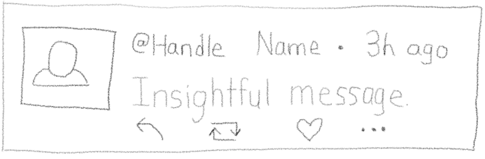
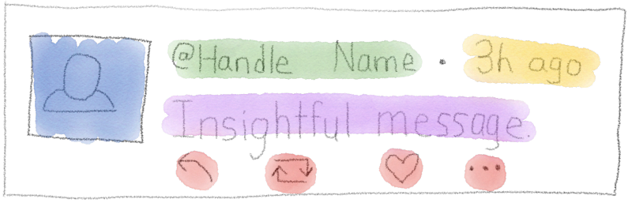
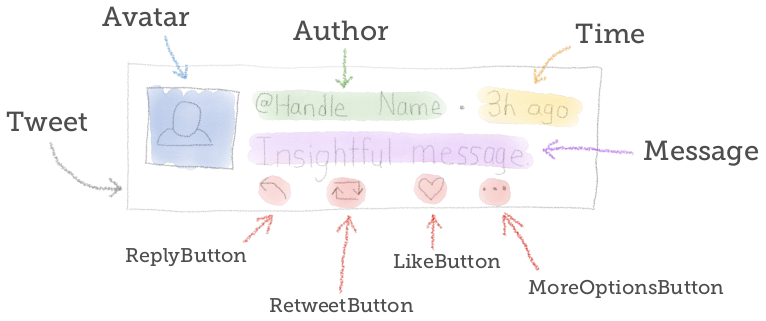
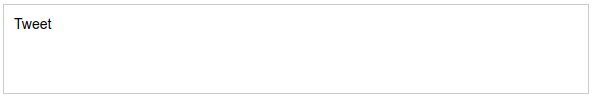
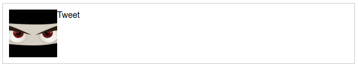
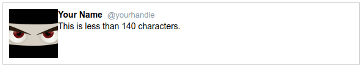
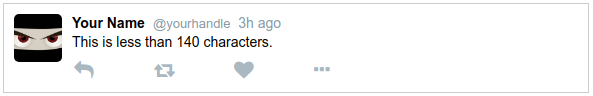

# Ejemplo componente Tweet:

Para aprender a "pensar en componentes", es necesario construir algunos, y comenzando con algo simple y agradable

Seguiremos un proceso de 4 pasos:

1. Boceto del resultado final
2. Dividir boceto en componentes
3. Definir nombre de los componentes
4. Escribir el código

## 1. Sketch

Pasar unos momentos usando lapicero (o lápiz) en papel puede ahorrar tiempo. Incluso sin ser bueno para dibujar (no es necesario que sea bonito).

Comenzar con un bosquejo humilde porque es concreto y da algo a lo que apuntar. En un proyecto más grande, esto podría provenir de un diseñador (como wireframes o maquetas) pero aquí, se recomienda esbozarlo mismo por cuenta propia antes de escribir cualquier código.

Aquí el boceto a partir del cual se construira:



## 2. Dividir boceto en componentes

El siguiente paso es dividir el boceto en componentes. Para hacer esto, dibujar cuadros alrededor de las "partes" y pensando en la reutilización.

Imaginar si se quisiera mostrar 3 tweets, cada uno con un mensaje y usuario diferente. ¿Qué se cambiaría y qué permanecería igual? Las partes que cambian serían nuevos componentes.

Otra estrategia es hacer de cada "cosa" un componente. Cosas como botones, fragmentos de texto relacionado, imágenes, etc.

Probar dividir y comparar con esto:



## 3. Definir nombre de los componentes

Ahora que se ha dividido el boceto en pedazos, hay que darles nombres.



Cada uno de estos elementos nombrados se convertirá en un componente, con Tweet como el "padre" que los agrupa a todos. La jerarquía seria así:

```html
• Tweet
    – Avatar
    – Author
    – Time
    – Message
    – ReplyButton
    – LikeButton
    – RetweetButton
    – MoreOptionsButton
```

 ## 4. Escribir el código

Ahora que sabemos cómo es el árbol de componentes, comenzar a construirlo. Hay dos maneras de abordar esto.

### De arriba hacia abajo o de abajo hacia arriba?

Opción 1: Comenzar en la parte superior. Primero construir el componente Tweet, luego construir sus hijos. Construir Avatar, Autor, y así sucesivamente.

Opción 2: Comenzar en la parte inferior (las "hojas" del árbol). Crear Avatar, Autor, el resto de los componentes secundarios. Verificar que funcionen de forma aislada. Una vez que todos se hayan terminado, reunirlos en el componente Tweet.

Entonces, ¿cuál es la mejor manera? Pues, depende (¿no es así siempre?).

Para una jerarquía simple, no importa mucho. Es más fácil comenzar desde arriba, así que eso es lo que se hará aquí.

Para una jerarquía más compleja, comenzar desde abajo. Construir piezas pequeñas, probar que funcionan de forma aislada y combinar a medida que se avanza. De esta manera, se puede estar seguro de que las piezas pequeñas funcionan y, por intuición, la combinación de ellas también debería funcionar (en teoría, de todos modos).

### Construir Tweet Component

Se construira un tweet estático simple, comenzando con el componente de nivel superior, Tweet.

Crear un nuevo proyecto con Create React App ejecutando el comando:

```shell
$ npx create-react-app static-tweet && cd static-tweet
```

Al igual que en el hola mundo, eliminar algunos de los archivos generados y crear index.js vacío. Como también se necesitará un poco de estilo, crear un index.css vacío.

```shell
$ rm src/*
$ touch src/index.js src/index.css
```

El proyecto recién generado viene con archivo index.html en el directorio public. Agregar Font Awesome colocando línea del CDN dentro de la etiqueta < head > (en una sola línea):

```html
<link rel="stylesheet" href="https://maxcdn.bootstrapcdn.com/font-awesome/4.6.3/css/font-awesome.min.css" >
```

Luego abrir el archivo src/index.css en blanco y reemplazar el contenido con esto:

```css
.tweet {
border : 1px solid #ccc;
width : 564px;
min-height : 68px;
padding : 10px;
display : flex;
font-family : "Helvetica", arial, sans-serif;
font-size : 14px;
line-height : 18px;
}
```

El archivo index.js será muy similar al de Hello World. Básicamente lo mismo, con "Tweet" en lugar de "Hello World". Crear el contenido de src/index.js escribiendo:

```js
import React from 'react';
import ReactDOM from 'react-dom';
import './index.css';

function Tweet() {
    return (
        <div className="tweet" >
            Tweet
        </div>
    );
}

ReactDOM.render(<Tweet />,
document.querySelector('#root'));
```

Haciendo esto. Iniciar el servidor, abriendo terminal de línea de comando y ejecutando:

```shell
$ npm start
```

Y la página debería representar algo como esto:



Esto no es algo que no se haya visto antes. Es un componente simple, con la adición de un atributo especial className (que React llama "prop", abreviatura de propiedad).

La mayoría de estas tienen nombres idénticos a los atributos que ya se conocen, pero className es especial porque su valor se convierte en el atributo de class en el nodo DOM.

Otra cosa nueva que quizás se nota es la importación './index.css' ¿un archivo CSS en un archivo JavaScript?

Lo que sucede es que detrás de escena, cuando Webpack construye la aplicación, ve esta importación de CSS y descubre que index.js depende de index.css. Webpack lee el archivo CSS y lo incluye en el JavaScript incluido (como una cadena) para enviarlo al navegador.

Continuando esquema de trabajo. Construir el componente Avatar en src/Avatar/Avatar.js.

```js
import React from 'react'

function Avatar() {
    return (
        
    );
}

export default Avatar
```

A continuación, incluir Avatar en el componente Tweet:

```js
import React from 'react';
import ReactDOM from 'react-dom';
import './index.css';
import Avatar from "./Avatar/Avatar";

function Tweet() {
    return (
        <div className="tweet" >
            <Avatar />
            Tweet
        </div>
    );
}

ReactDOM.render(<Tweet />,
document.querySelector('#root'));
```

Ahora solo dar un poco de estilo a Avatar, en index.css:

```css
.avatar {
width : 48px;
height : 48px;
border-radius : 5px;
margin-right : 10px;
}
```

Está mejorando:



A continuación, crear dos componentes más, Message y Author:

```js
function Message() {
    return (
        <div className="message" >
            This is less than 140 characters.
        </div>        
    );
}

function Author() {
    return (
        <span className="author" >
            <span className="name" > Your Name </span>
            <span className="handle" > @yourhandle </span>
        </span>        
    );
}
```

Si se actualiza después de agregar estos, nada habrá cambiado porque aún se necesita actualizar Tweet para usar estos nuevos componentes, hacer lo siguiente:

```js
import Avatar from "./Avatar/Avatar";
import Author from "./Author/Author";
import Message from "./Message/Message";

function Tweet() {
    return (
        <div className="tweet" >
            <Avatar />
            <div className="content">
                <Author />
                <Message />
            </div>
        </div>
    );
}
```

Está renderizando, pero algo feo. Arreglar con un poco de CSS para nombre y el identificador:

```css
.name {
font-weight : bold;
margin-bottom : 0.5em;
margin-right : 0.3em;
}

.handle {
color : #8899a6;
font-size : 13px;
}
```



Ahora se parece más a un tweet real.

A continuación, agregar Time y botones (simplemente escribir como se muestra):

```js
const Time=() => (
    <span className="time" > 3h ago </span>
);

const ReplyButton=() => (
    <i className="fa fa-reply reply-button" />
);

const RetweetButton=() => (
    <i className="fa fa-retweet retweet-button" />
);

const LikeButton=() => (
    <i className="fa fa-heart like-button" />
);

const MoreOptionsButton=() => (
    <i className="fa fa-ellipsis-h more-options-button" />
);
```

Estos componentes no se parecen a las funciones que se han estado escribiendo hasta el momento, pero siguen siendo funciones. Son funciones de flecha. Aquí hay una progresión de una función regular a una función de flecha para que pueda ver lo que está sucediendo:

```js
// componente de función normal:
function LikeButton() {
return (
    <i className="fa fa-heart like-button" />
);
}

// Se puede reescribir como
// función anónima y almacenada en una
// variable constante:
const LikeButton = function () {
return (
<i className="fa fa-heart like-button" />
);
}

// La función anónima puede ser
// convertida en una función de flecha:
const LikeButton = () => {
return (
<i className="fa fa-heart like-button" />
);
}

// Se puede simplificar eliminando
// las llaves y el `return`:
const LikeButton = () => (
<i className="fa fa-heart like-button" />
);

// Y queda realmente simple,
// incluso escribirlo en una línea:
const Hi = () => <span> Hi </span> ;
```

Las funciones de flecha son una buena forma concisa de escribir componentes.

Se tiende a escribir como función cuando el componente es un poco más grande, y uso con const () => (...) cuando solo son un par de líneas. Algunas personas prefieren escribir funciones de flecha en todas partes.

### Palabras clave let y const

ES6 agregó *let* y *const* como dos nuevas formas de declarar variables de ámbito de bloque.

La palabra clave *let* define una variable mutable (modificable). Puede usarse en lugar de *var* casi en todas partes.

El *const* define una constante. Si se intenta reasignar la variable, arrojará un error, pero vale la pena señalar que no le impide modificar los datos dentro de esa variable. Ejemplo:

```js
const answer = 42;
answer = 43;
// error!
const numbers = [1, 2, 3];
numbers[0] = 'this is fine'; // no error
```

Usar const es más una señal de intención que un esquema de protección, pero todavía vale la pena verlo asi.

### Agregar Buttons y Time

Ahora se tienen todos esos componentes nuevos, actualizar Tweet (index.js) nuevamente para incorporarlos:

```js
function Tweet() {
    return (
        <div className="tweet" >
            <Avatar />
            <div className="content">
                <Author /><Time />
                <Message />
                <div className="buttons" >
                    <ReplyButton />
                    <RetweetButton />
                    <LikeButton />
                    <MoreOptionsButton />
                </div>
            </div>
        </div>
    );
}
```

Finalmente, agregar algunos estilos más para cubrir el tiempo y los botones:

```css
.time {
padding-left : 0.3em;
color : #8899a6;
}

.time ::before {
content : "\00b7";
padding-right : 0.3em;
}

.buttons {
margin-top : 10px;
margin-left : 2px;
font-size : 1.4em;
color : #aab8c2;
}

.buttons i {
width : 80px;
}
```

Y asi tenemos un tweet de aspecto bastante respetable! Lo siguiente es aprender a parametrizar componentes con
props.

