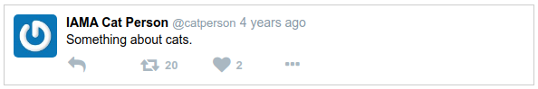

# Ejemplo Tweet con Props

Ahora que se tiene una comprensión básica de las props, se verá cómo funcionan en la práctica.

Tomando el ejemplo estático de Tweet anterior y se modificará para mostrar datos dinámicos mediante el uso de props.

Hacer una copia de la carpeta del proyecto de static-tweet para que poder trabajar sin temor a romper el código anterior. También iniciar un servidor de desarrollo.

```shell
$ cp -a static-tweet props-tweet && cd props-tweet
$ npm start
```

- Nota: No usar *cp -r* ya que no conserva enlaces simbólicos y puede interrumpir el inicio de npm.

Si, después de copiar el proyecto, el comando *npm start* falla, eliminar la carpeta *node_modules* y ejecutar *npm install*. Entonces intentar *npm start* de nuevo.

Abrir src/index.js. Para comenzar, actualizar el componente Tweet para aceptar prop de tweet como se muestra a continuación. Luego agregar el objeto testTweet, que servirá como datos falsos, y actualizar la llamada a ReactDOM.render para pasar el objeto testTweet como prop de tweet.

```js
// agregar prop {tweet}, desestructurado
function Tweet({ tweet }) {
    return (
        <div className="tweet" >
            <Avatar />
            <div className="content">
                <Author /><Time />
                <Message />
                <div className="buttons" >
                    <ReplyButton />
                    <RetweetButton />
                    <LikeButton />
                    <MoreOptionsButton />
                </div>
            </div>
        </div>
    );
}

// ...

const testTweet={
    message: "Something about cats.",
    gravatar: "xyz",
    author: {
        handle: "catperson",
        name: "IAMA Cat Person"
    },
    likes: 2,
    retweets: 20,
    timestamp: "2016-07-30 21:24:37"
};

ReactDOM.render(<Tweet tweet={testTweet}/>,
    document.querySelector('#root'));
```

## Avatar

Comenzar a convertir los componentes estáticos para aceptar props, comenzando con el Avatar. En el método de renderizado de Tweet, reemplazar esta línea:

```js
<Avatar/>
```

Con esta linea:

```js
<Avatar hash={tweet.gravatar} />
```

Esto pasa la propiedad gravatar del tweet al prop de hash. Ahora actualizar Avatar para usar esta nueva prop:

```js
function Avatar({ hash }) {
    const url=`https://www.gravatar.com/avatar/${hash}`;
    return (
        
    );
}
```

El hash Gravatar, pasado como hash usando la desestructuración de ES6, se incorpora a la URL y se pasa a la etiqueta de la imagen como antes.

### ES6: Template Strings

Un poco más de ES6: los backticks alrededor de la cadena de URL son una sintaxis para plantilla cadenas. La parte ${hash} se reemplazará con el hash mismo. Esta sintaxis es un poco más limpia que la concatenación de cadenas como "https://www.gravatar.com/avatar/" + hash.

Es especialmente agradable cuando se necesita concatenar varias cadenas juntas. Ejemplo:

```js
// Usando template string:
person = `${firstName} ${lastName}`;
// versus concatenar:
person = firstName + " " + lastName;

// contruyendo url:
url = `foo.com/users/${userId}/items/${itemId}`;
// versus:
url = "foo.com/users/" + userId + "/items/" + itemId;
```

El avatar debe representarse sin problema.

## Message

Ahora con Message. Reemplazar esta línea en el método de render de Tweet:

```js
<Message/>
```

Con esta linea:

```js
<Message text={tweet.message} />
```

Para extraer el mensaje del tweet y pasarlo al componente Message como text. Luego actualizar el componente Message para usar la nueva prop:

```js
function Message({ text }) {
    return (
        <div className="message" >
            {text}
        </div>        
    );
}
```

En lugar de texto estático en el div, se muestra la prop de text que se pasó. Ahora se verá que el mensaje ahora es "Something about cats."

## Author y Time

Esta vez convertir dos componentes a la vez: Author y Time. Actualizar Tweet para pasar los datos relevantes reemplazando esta línea en render:

```js
<Author/><Time/>
```

Con estas lineas:

```js
<Author author={tweet.author} />
<Time time={tweet.timestamp} />
```

Se introducira una biblioteca llamada Moment.js para trabajar con fechas y horas. Se usará para calcular la cadena de tiempo relativa ("hace 3 días"). Ejecutar este comando en la terminal para instalar Moment:

```shell
npm i --save moment
```

Luego, importar Moment en la parte superior del archivo index.js, así agregar esta línea en la parte superior:

```js
import moment from 'moment';
```

Ahora actualizar los componentes Author y Time. Time usando la libreria de moment.

```js
function Author({ author }) {
    const { name, handle }=author;
    return (
        <span className="author" >
            <span className="name" >{name}</span>
            <span className="handle" >@{handle}</span>
        </span>        
    );
}

const Time=({ time }) => {
    const timeString=moment(time).fromNow();
    return (
        <span className="time" >
            {timeString}
        </span>
    );
};
```

En el ejemplo de tweet estático, Time se escribió como una función de flecha, así que dejo así. Sin embargo, debido a que ahora tiene 2 declaraciones, necesita las llaves, lo que hace que necesite un retorno. Se podría simplificar esto moviendo *moment(time).fromNow()* directamente dentro del < span >, y luego eliminar el retorno y las llaves. Se deja en manos de propio sentido del estilo.

### Qué se debe pasar exactamente como Prop?

Las props pueden aceptar todo tipo de cosas: números, booleanos, cadenas, objetos, incluso funciones. Al principio puede preguntarse, ¿debe pasar un objeto y dejar que el componente extraiga lo que necesita? ¿O debería pasar los datos específicos que requiere el componente? En ejemplo de Tweet, estamos pasando datos específicos.

En su lugar, se quiza simplemente pasar el objeto de tweet en sí. Por ejemplo, en lugar de pasar una marca de tiempo directamente al componente Time, podríamos pasar un tweet y dejar que se extraiga la marca de tiempo del tweet.
¿Por qué no hacerlo de esa manera? Aquí hay algunas razones:

• Daña la reutilización: si Time espera un objeto con una propiedad llamada “timestamp”, entonces se está bloqueado en esa estructura. ¿Qué sucede si tiene un usuario con una propiedad de marca de tiempo llamada “up-date_at” y se desea representarlo con un componente Time? Bueno, no puede, sin hackear juntos un objeto temporal que "se parezca" a lo que Time espera, o cambiar la implementación de Time (potencialmente rompiendo otros usos de él).

• Es más difícil de cambiar: el componente Time tendría conocimiento de la estructura interna de un objeto de tweet. Esto podría no parecer gran problema, hasta que se tenga 10 componentes como este, y el desarrollador backend decida que "timeStamp" con una "S" mayúscula se ve mejor que "timestamp" y ahora se tiene que actualizar todos esos componentes. Es una buena idea mantener el conocimiento de las estructuras de datos contenidas en el menor número posible de lugares para reducir el costo del cambio.

## Los componentes restantes

Convertir Tweet y sus hijos para usar props. Solo quedan dos componentes: RetweetButton y LikeButton, que necesitan mostrar recuentos de retweets y me gusta. Actualmente, no muestran ningún número en absoluto, solo un icono.

Cambiar estas líneas:

```js
<RetweetButton/>
<LikeButton/>
```

A estas líneas (pasando los recuentos):

```js
<RetweetButton count={tweet.retweets} />
<LikeButton count={tweet.likes} />
```

Luego, actualizar RetweetButton y LikeButton para aceptar nueva prop de count y renderizar sus números respectivos:

```js
const RetweetButton=({ count }) => (
    <span className="retweet-button" >
        <i className="fa fa-retweet" />
        {getRetweetCount(count)}
    </span>
);

function getRetweetCount(count) {
    if (count>0) {
        return (
            <span className="retweet-count" >
                {count}
            </span>
        );
    } else {
        return null;
    }
}

const LikeButton=({ count }) => (
    <span className="like-button" >
        <i className="fa fa-heart" />
        {count>0&&
            <span className="like-count" >
                {count}
            </span>}
    </span>
);
```

Finalmente, el estilo también necesita actualización. Seleccionar como referencia estas líneas:

```css
.buttons i {
width : 80px;
}
```

Luego reemplazar con esto:

```css
.reply-button, .retweet-button,
.like-button, .more-options-button {
width : 80px;
display : inline-block;
}

.like-count, .retweet-count {
position : relative;
bottom : 2px;
font-size : 13px;
margin-left : 6px;
font-weight : bold;
}
```

Aquí va!



A pesar de tener un aspecto diferente, estos componentes tienen la misma lógica para determinar cómo mostrar el recuento.

## RetweetButton

En RetweetButton, el cálculo se extrae en una función separada llamada getRetweetCount. Devuelve un elemento < span > o null.

La función getRetweetCount podría escribirse como un componente, ya casi es uno. Así es como se vería:

```js
function Count({ count }) {
    if (count > 0) {
        return (
            <span className="retweet-count" >
            {count}
            </span>
        );
    } else {
        return null ;
    }
}

const RetweetButton = ({ count }) => (
    <span className="retweet-button" >
    <i className="fa fa-retweet" />
    <Count count={count} />
    </span>
);
```

La función tuvo que ser renombrada para comenzar con una letra mayúscula (por convencion los nombres de los componentes deben comenzar con una letra mayúscula), y su argumento necesitaba ser reemplazado por una desestructuración para extraer el recuento.

De lo contrario, se ve igual. Luego, usarlo en RetweeetButton es solo una cuestión de insertar algo de JSX.

## LikeButton

Para LikeButton, la lógica se realiza de manera ligeramente diferente. En lugar de extraer la lógica a una función, se realiza en línea con un operador booleano (el &&). Pero, de nuevo, representa un span, o null.

### Otra opción

Hay una tercera alternativa, que difiere ligeramente en que siempre generará un < span > con la clase "like-count", pero donde el contenido puede estar vacío:

```js
const LikeButton = ({ count }) => (
    <span className="like-button" >
        <i className="fa fa-heart" />
        <span className="like-count" >
        {count ? count : null }
        </span>
    </span>
);
```

Como se puede ver, hay más de una forma de lograr lo mismo con JSX.