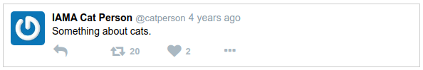

# Ejemplo Tweet con PropTypes

Por tercera y ultima vez, volviendo al ejemplo de Tweet para ver cómo aplicar PropTypes a un conjunto real de componentes.

Recordar, la estructura esta así:

```html
• Tweet
    – Avatar
    – Author
    – Time
    – Message
    – ReplyButton
    – LikeButton
    – RetweetButton
    – MoreOptionsButton
```

Y así es como debería verse actualmente:



Comenzando de abajo hacia arriba, agregar PropTypes a estos componentes. Hacer una copia del código props-tweet de antes para poder modificarlo sin temor de estropear el código anterior:

```shell
$ cp -a props-tweet proptypes-tweet && cd proptypes-tweet
$ npm start
```

Agregar el paquete prop-types e importarlo:

```shell
$ npm i --save prop-types
```
```js
import PropTypes from 'prop-types';
```

Los botones son un buen lugar para comenzar. *MoreOptionsButton* no acepta props, por lo que no es necesario modificarlo.

LikeButton puede tomar opcionalmente una prop count, por lo que se agrega PropType para eso:

```js
const LikeButton=({ count }) => (
    <span className="like-button" >
        <i className="fa fa-heart" />
        {count>0&&
            <span className="like-count" >
                {count}
            </span>}
    </span>
);

LikeButton.propTypes={
    count: PropTypes.number
};
```

Para verificar que funciona, ir al componente Tweet e intentar pasar una cadena en lugar de un número al LikeButton:

```js
// Re:
<LikeButton count={tweet.likes} />

// Con esto:
<LikeButton count='foo' />
```

Si se actualiza (pagina navegador automáticamente), debería verse una advertencia en la consola del navegador como esta:

    - Warning: Failed prop type: Invalid prop ‘count‘ of type ‘string‘ supplied to ‘LikeButton‘, expected ‘number‘. Check the render method of ‘Tweet‘.

Bueno. Esta funcionando la validación correctamente.

Cambiar esa línea de nuevo a como estaba antes y ahora agregar un PropType de count al componente RetweetButton de la misma manera.

También descubrir los PropTypes para Message y Time (ambos toman cadenas opcionales). Hacerlos también.

Author es un poco más interesante: se necesita un objeto de author que debería tener propiedades de name y handle. ¿Alguna idea de cómo se implementaría eso usando uno de los validadores con React?

Si se dijera PropTypes.shape, se estaría en lo correcto. También se acepta PropTypes.object, aunque eso sea un poco menos explícito. Ver cómo se vería el validador de forma en el componente:

```js
function Author({ author }) {
    const { name, handle }=author;
    return (
        <span className="author" >
            <span className="name" >{name}</span>
            <span className="handle" >@{handle}</span>
        </span>        
    );
}

Author.propTypes = {
    author : PropTypes.shape({
        name : PropTypes.string.isRequired,
        handle : PropTypes.string.isRequired
}).isRequired
};
```

Aquí, se requiere la prop de author, y debe tener un name y un handle como strings.

Es importante tener en cuenta: los PropTypes son una excelente herramienta de depuración, pero una validación fallida no detendrá la ejecución del código. Vigilar eso en ventana de la consola.

## Qué tan explícito ser?

Cuando el objeto pasado a un componente es simple, es fácil justificar escribir un PropType de forma (shape). Sin embargo, cuando el objeto es más complejo, se puede comenzar a preguntar si vale la pena el esfuerzo. La respuesta dependerá del caso en particular. Si se va por la borda con shape, podría ser un dolor mantenerlo más tarde.