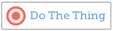

# Los Children

Se ha visto cómo JSX admite anidación de componentes, al igual que HTML. Y que los componentes personalizados pueden aceptar props como argumentos, y usar esas props para representar contenido o pasar a componentes secundarios.

Hay una prop especial de la que aún no se ha hablado: se llama *children*.

Suponer que se desea crear un componente IconButton reutilizable que se vea así:



E imaginar usarlo así:

```js
<IconButton> Do The Thing </IconButton>
```

¿Qué sucede a ese texto interno, "Do The Thing"? Bueno, ahí es donde entra la prop para children. Cuando React muestre IconButton, pasará todos sus subelementos (en este caso, el texto "Do The Thing") a IconButton como prop llamada children.

Los elementos secundarios se pasan automáticamente, pero no se muestran automáticamente en ningún lado. Se debe colocar explícitamente a los children en algún lugar de su componente. Si no se hace, serán ignorados. Por ejemplo, si el componente IconButton se ve así:

```js
function IconButton() {
    return (
        <button>
        <i class="target-icon" />
        </button>
    );
}
```

El componente representado sería un botón con un icono y sin texto. Se vería así:


Con un pequeño ajuste, aceptando la prop de los children y luego insertándolo después del icono, los hijos pasados se mostrarán donde se indiquen:

```js
function IconButton({ children }) {
    return (
        <button>
        <i class="target-icon" />
        {children}
        </button>
    );
}
```

Observar cómo Children está disponible como prop en IconButton a pesar de que no se paso explícitamente una prop llamada children. Esto se debe a que React pasa automáticamente el contenido de un componente como elemento secundario. Se puede lograr el mismo resultado usando IconButton pasando explícitamente la prop children, en su lugar:

```js
<IconButton children={"Do The Thing"} ></IconButton>
```

Parece un poco antinatural, pero funciona. La convención es colocar a los children dentro de la etiqueta y no pasarlos explícitamente como props, pero se demuestra que los children se pueden usar como cualquier otra prop.

También se puede pasar JSX a una prop. Si se quisiera colocar el texto del botón en cursiva, se podría escribir de las siguientes maneras:

```js
<IconButton children={ <em> Just Do It </em> } />

<IconButton>
    <em> Just Do It </em>
</IconButton>
```

También se puede pasar JSX a cualquier prop, no solo a “children”.

Como ejemplo, un componente de Confirmación que muestre un cuadro de diálogo con los botones Aceptar y Cancelar. Si se desea poder personalizar el título y el mensaje del cuadro de diálogo, escribirlo para aceptar el título y el mensaje como props separadas y luego usarlo así:

```js
<Confirmation
    title={ <h1> Are you sure? </h1> }
    message={ <strong> Really really sure? </strong> }
/>
```