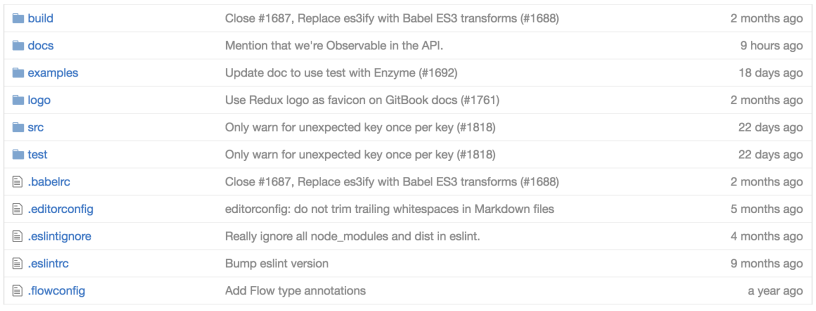
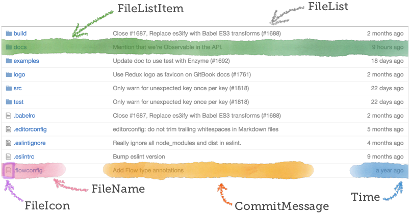
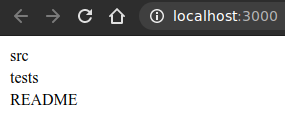

# Parte inicial

Ahora que se tiene conocimiento y practica de componentes. Pues se ha visto props, propTypes, y se ha escrito algo de JSX.

Antes de pasar a ver sobre el state y la interactividad, probar practicando con un ejemplo que incorpora todos los temas anteriores.

Con eso en mente, se creerá una mini aplicación que replica la lista de archivos de GitHub.

Se seguirá un proceso de 4 pasos:

1. Comenzar con un boceto/maqueta/captura de pantalla
2. Dividir en componentes
3. Nombrar los componentes
4. Escribir el código

Captura de pantalla de la interfaz de usuario de GitHub a modelar después de la aplicación:



## Dividir en componentes

El primer paso es delinear o resaltar todos los componentes ya que se definio por una captura de pantalla. Básicamente, lo que se hace aquí es dibujar cuadros alrededor de los elementos en el diseño, ya sea div u otro bloque de construcción HTML.



## Nombrar los componentes

Una vez que se haya decidido qué partes serán componentes, asignarles nombres. Para las áreas resaltadas arriba, sugerencia de estos nombres (indentación para mostrar las relaciones padre/hijo):

```html
• FileList

    – FileListItem

        * FileName
            · FileIcon

        * CommitMessage

        * Time
```

## Se puede reutilizar algo?

Mirar a través de la lista de componentes y ver si puede ahorrarse trabajo en cualquier lugar.

El componente **Time** se parece mucho al del ejemplo hecho para Tweet. Se escribio ese componente genéricamente, para aceptar dato de tiempo en lugar de un tweet. Se puede reutilizarlo aquí.

## Qué datos necesita cada componente?

A continuación, descubrir qué datos debe procesar cada componente. Esto resultará en las props y propTypes para cada uno.

Ver si se puede encontrar la definición de **propTypes** para cada uno de estos sin mirar en como seria el código.

**FileList** debe tomar una prop, files, que es un array de objetos de file.

**FileListItem** tomará un único objeto de file como prop de file. Ese objeto debe tener name, type, commit con un mensaje y time de última modificación.

**FileName** tomará un objeto de file y esperará que tenga una propiedad de name.

Por último, **Time** tomará una cadena de time absoluta. Se reutilizará el componente Time de Tweet, propTypes y lo que se pueda.

### De arriba hacia abajo o de abajo hacia arriba?

Se comenzará desde arriba y se trabajará hacia abajo esta vez.

### Hacer el flujo funcionar

Alguna vez se ha tenido la experiencia de codificar, hacia abajo, durante mucho tiempo sin ejecutar el código? E inevitablemente, hay algo mal cuando lo ejecutas la primera vez.

Es decepcionante y te quita los buenos animos. Se termina rastreando un montón de errores de sintaxis, errores lógicos y cualquier otra cosa antes de que se pueda ver que el arduo trabajo cobra vida.

Mientras se escribe, intentar hacer pequeños cambios y actualizar con frecuencia. Asegurarse de que el código siempre funcione.

## FileList

Teniendo suficiente dirección para comenzar a trabajar. Crear un nuevo proyecto de la misma manera que se ha hecho antes:

```shell
$ npx create-react-app github-file-list
$ cd github-file-list
$ rm src/*
$ touch src/index.js src/index.css
```

Copiar el archivo index.html del proyecto de tweet, del directorio "public". Esto configurará con los iconos de Font Awesome del CDN. Cambiar el < title > si se desea, y ya.

Abrir src/index.js

Se recuerda cómo comenzar en el archivo con las importaciones y cómo configurar la llamada de renderizado inicial con ReactDOM.render? Intentar hacerlo de memoria. Revisar el ejemplo de Tweet si se tiene problemas recordando.

Crear el componente **FileList**. Con la intención de hacer lo más simple y que pueda funcionar, se representara una lista de nombres de archivos sin ordenar. Una vez que funcione, se extraerán los elementos de la lista en un componente FileListItem.

```js
// colocar los necesarios imports aqui

const FileList=({ files }) => (
    <table className="file-list" >
        <tbody>
            {files.map(file => (
                <tr className="file-list-item" key={file.id} >
                    <td className="file-name" > {file.name} </td>
                </tr>
            ))}
        </tbody>
    </table>
);

FileList.propTypes={
    files: PropTypes.array
};

// colocar llamada ReactDOM.render aquí
// pasar testFiles como files prop de FileList

// en archivo externo fake data a importar
const testFiles=[
    {
        id: 1,
        name: 'src',
        type: 'folder',
        updated_at: "2016-07-11 21:24:00",
        latestCommit: {
            message: 'Initial commit'
        }
    },
    {
        id: 2,
        name: 'tests',
        type: 'folder',
        updated_at: "2016-07-11 21:24:00",
        latestCommit: {
            message: 'Initial commit'
        }
    },
    {
        id: 3,
        name: 'README',
        type: 'file',
        updated_at: "2016-07-18 21:24:00",
        latestCommit: {
            message: 'Added a readme'
        }
    },
];

export default testFiles
```

Por el momento la representación seria:



Mapear sobre un array como este es cómo se procesan las listas de cosas en React.

Si no se ha visto suficiente antes, la función **map** de Array devuelve un nuevo array que tiene el mismo tamaño que su matriz existente, pero donde cada elemento se reemplaza por un nuevo valor. La función que se proporciona a map decide, al devolver un valor, cómo transformar cada elemento en un nuevo valor.

Como el nombre "map" implica, crea un "mapeo" de su array existente a un nuevo array. En este caso, devuelve una nueva matriz donde cada archivo se ha convertido en una fila de tabla con una celda que muestra el nombre del archivo.
