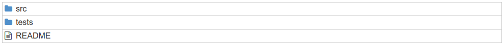
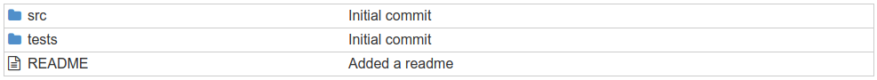
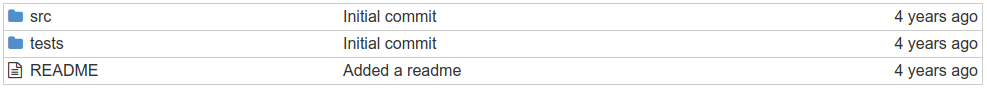

# Parte 2: la Prop 'key'

La prop **key** en el < tr > es especial, y se requiere cada vez que se renderiza un array de elementos.
React lo utiliza para distinguir los componentes al conciliar las diferencias durante un renderizado. Si se desea obtener más detalles sobre por qué las key son importantes, leer documentación oficial sobre el [algoritmo de reconciliación](https://reactjs.org/docs/reconciliation.html).

Cada vez que se use **map** para representar un array, también se necesitará una key en el elemento superior. React consume la prop de key antes de renderizar, por lo que el componente al que se le pasa la key no recibirá esa prop.

Como desarrollador, se debe decidir qué pasar como key. Lo importante a tener en cuenta es que las key deben ser estables, permanentes y únicas para cada elemento del array.

• Estable: un elemento siempre debe tener la misma key, independientemente de su posición en el array. Esto significa que key={index} es una mala elección.

• Permanente: la key de un elemento no debe cambiar entre los renderizados. Esto significa que key = {Math.random ()} es una mala elección.

• Única: no debe haber dos elementos que tengan la misma clave.

Si un elemento tiene ID unico adjunto, es excelente opción para la key. Si los elementos no tienen ID, intentar combinar varios campos para crear un ID único.

## FileListItem

En general, es una buena idea crear un componente independiente para representar los elementos individuales en una lista, que es lo que se hará. Aunque este ejemplo es pequeño y podría dejarse solo, es para demostrar el proceso.

Considerar que todavía se tiene que pasar la prop de key. La key debe decidirse en el momento del "map" y pasarse allí mismo. No se puede insertar ese detalle en el componente FileListItem.

```js
const FileList=({ files }) => (
    <table className="file-list" >
        <tbody>
            {files.map(file => (
                /* ahora se usa FileListItem aquí */
                <FileListItem key={file.id} file={file} />
            ))}
        </tbody>
    </table>
);

FileList.propTypes={
    files: PropTypes.array
};

const FileListItem=({ file }) => (
    /* este código ha sido extraído de FileList */
    <tr className="file-list-item" >
        <td className="file-name" > {file.name} </td>
    </tr>
);

FileListItem.propTypes={
    file: PropTypes.object.isRequired
};
```

También agregar un poco de CSS para hacerlo más presentable. Abrir src/index.css y reemplazar su contenido con:

```css
.file-list {
font-family : Helvetica, sans-serif;
width : 100%;
max-width : 980px;
color : #333;
margin : 0 auto;
border : 1px solid #ccc;
border-collapse : collapse;
}

.file-list td {
border-top : 1px solid #ccc;
}

.file-name {
padding : 4px;
max-width : 180px;
}
```

No olvidar agregar la línea para importar el archivo CSS (import './index.css').

Ahora que se tiene una estructura básica en su lugar, se puede agregar los componentes restantes al componente de fila: FileIcon, FileName, CommitMessage y Time.

Primero hacer FileIcon y FileName, ya que están anidados juntos. Según la maqueta, FileName es el padre de FileIcon. Y como se estan colocando en una tabla, sería bueno mantenerlos en celdas separadas. Intentar escribir el código...

Aquí FileIcon. Es sencillo: un componente sin estado escrito como una función simple.

```js
function FileIcon({ file }) {
    let icon='fa-file-text-o';
    if (file.type==='folder') {
        icon='fa-folder';
    }
    
    return (
        <td className="file-icon" >
            <i className={`fa ${icon}`} />
        </td>
    );
}

FileIcon.propTypes={
    file: PropTypes.object.isRequired
};
```

Aquí FileName, que usa la sintaxis del fragmento < > para envolver los dos elementos que devuelve. Las celdas de la tabla (< td >) deben ser hijos directos de las filas de la tabla (< tr >) sin ningún elemento contenedor entre ellas, por lo que aquí se necesita un fragmento en lugar de un div. (Esta regla proviene de HTML, no React)

```js
function FileName({ file }) {
    return (
        <>
            <FileIcon file={file} />
            <td className="file-name" > {file.name} </td>
        </>
    );
}

FileName.propTypes={
    file: PropTypes.object.isRequired
};
```

Luego, está el FileListItem actualizado que usa el componente FileName:

```js
const FileListItem=({ file }) => (
    <tr className="file-list-item" >
        <FileName file={file} />
    </tr>
);

FileListItem.propTypes={
    file: PropTypes.object.isRequired
};
```

Ahora agregar un poco de CSS y ver cómo va.

```css
.file-icon {
width : 17px;
padding-left : 4px;
}

.file-icon .fa-folder {
color : #508FCA;
}
```



## CommitMessage

A continuación, crear el componente CommitMessage, y luego representar un CommitMessage dentro de FileListItem.

```js
const FileListItem=({ file }) => (
    <tr className="file-list-item" >
        <FileName file={file} />
        <CommitMessage commit={file.latestCommit} />
    </tr>
);

// ...

const CommitMessage=({ commit }) => (
    <td className="commit-message" >
        {commit.message}
    </td>
);

CommitMessage.propTypes={
    commit: PropTypes.object.isRequired
};
```

Y adecuar diseño con un poco de estilo:

```css
.commit-message {
max-width : 442px;
padding-left : 10px;
overflow : hidden;
}
```



Observar que se esta pasando el commit en sí en lugar del objeto file completo. CommitMessage no necesita saber nada sobre archivos, y cuantos menos componentes tengan conocimiento de las estructuras de datos, mejor.

## Time

Agregar Time. Reutilizar el componente Time del ejemplo Tweet. En lugar de simplemente copiar y pegar el componente Time en este archivo, extraer en su propio archivo para que otros componentes también puedan usarlo.

Por facilidad se agregará Moment.js nuevamente, así que instalar:

```shell
$ npm i --save moment
```

Luego crear el archivo src/Time.js y copiar del componente Time de antes. También agregar importaciones necesarias de React en la parte superior y una exportación en la parte inferior.

```js
import React from 'react';
import PropTypes from 'prop-types';
import moment from 'moment';

const Time=({ time }) => {
    const timeString=moment(time).fromNow();
    return (
        <span className="time" >
            {timeString}
        </span>
    );
};

Time.propTypes={
    time: PropTypes.string.isRequired
};

export default Time;
```

Sobre la sintaxis de exportación por default en la parte inferior. Esta es la forma ES6 de hacer que un componente esté disponible para que pueda importarse a otros archivos. El "default" significa que este es el componente que obtendremos cuando usemos **import Time from './Time'**.

La alternativa es hacer de esto una exportación con nombre, que se vería como **export {Time}**, con las llaves. Entonces la importación correspondiente se vería como **import {Time} from './Time'**.

Las importaciones son todo acerca de las llaves. ¿Sin llaves? Se esta importando el default. Con llaves? Se esta importando una exportación con nombre. Incluso pueden mezclarse:

```js
import React, {Component} from 'react';
```

Pensar en esto como en la desestructuración, donde el módulo es el "objeto" y se está extrayendo elementos con nombre de él.

Ahora usar Time dentro de FileListItem. Importarlo primero agregando esta línea en la parte superior de index.js:

```js
import Time from './Time';
```

Dado que este es archivo propio en lugar de algo de node_modules, la ruta debe ser relativa (./Time), en lugar de simplemente el nombre del módulo (Time). Es común nombrar archivos de componentes en PascalCase (con la letra mayúscula inicial), pero puede nombrarse como se prefiera.

Luego, actualizar FileListItem, y Time que no representa en un < td >, por lo que debe ajustarse en uno:

```js
const FileListItem=({ file }) => (
    <tr className="file-list-item" >
        <FileName file={file} />
        <CommitMessage commit={file.latestCommit} />
        <td className="age" >
            <Time time={file.updated_at} />
        </td>
    </tr>
);
```

Y agregar un poco de estilo...

```css
.age {
width : 125px;
text-align : right;
padding-right : 4px;
}
```

Asi queda:



Una mejor manera de organizar la parte del FileListItem sería dejar las "cosas" de tabla dentro de la tabla y dejar que los componentes se preocupen solo por sus propios datos. Algo como esto:

```js
const FileListItem = ({ file }) => (
    <tr className="file-list-item" >
        <td><FileIcon file={file} /></td>
        <td><FileName file={file} /></td>
        <td><CommitMessage commit={file.latestCommit} /></td>
        <td><Time time={file.updated_at} /></td>
    </tr>
);
```

Tratar de mejorar el enfoque es lo ideal para que el codigo sea más limpio y reusable.