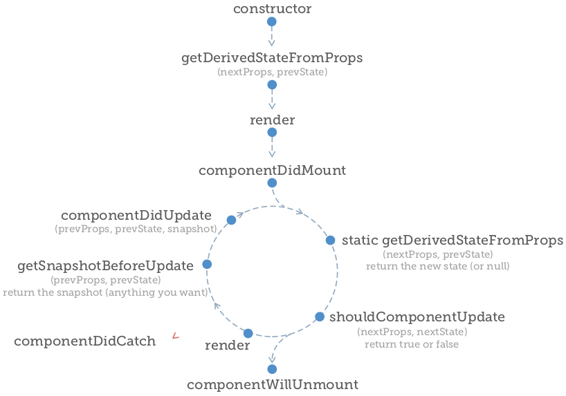

# El ciclo

Todos los componentes de React pasan por un ciclo de vida tal a como se renderizan en pantalla. Hay una secuencia de métodos llamados en un orden específico. Algunos de ellos solo se ejecutan una vez, y otros se ejecutan varias veces.

Para la mayoría de los componentes que se construyen, no será necesario aprovechar los métodos del ciclo de vida. Pero cuando se necesitan, no se pueden pasar por alto. Ya sea que se necesite hacer llamadas AJAX para obtener datos, insertar sus propios nodos en el DOM o configurar temporizadores, los métodos de ciclo de vida son el lugar para hacerlo.

El ciclo de vida completo de un componente:

Aprovechar un hook de ciclo de vida es tan simple como agregar la función adecuada a su clase de componente. Los métodos de ciclo de vida solo están disponibles para componentes de clase, NO para los funcionales.