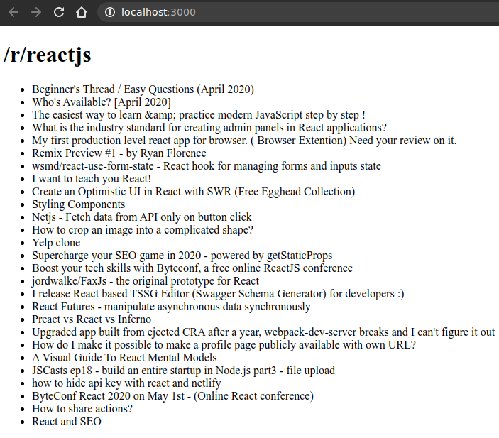

# Obtener datos y mostrarlos

Se deja un componente de ejemplo simple que obtiene publicaciones de Reddit. Crear un nuevo proyecto de la misma manera que se ha hecho antes y escribir el código. Luego revisar que está sucediendo.

```js
import React from 'react';
import ReactDOM from 'react-dom';
import axios from 'axios';

class Reddit extends React.Component {
    state={
        posts: []
    };

    componentDidMount() {
        axios
            .get(
                `https://www.reddit.com/r/${
                this.props.subreddit
                }.json`
            )
            .then(res => {
                const posts=res.data.data.children.map(
                    obj => obj.data
                );
                this.setState({ posts });
            });
    }

    render() {
        const { posts }=this.state;
        return (
            <div>
                <h1> {`/r/${this.props.subreddit}`} </h1>
                <ul>
                    {posts.map(post => (
                        <li key={post.id} > {post.title} </li>
                    ))}
                </ul>
            </div>
        );
    }
}

ReactDOM.render(
    <Reddit subreddit="reactjs" />,
    document.querySelector('#root')
);
```

Primero, se inicializa el estado en la parte superior. Esto es importante porque el componente se procesará al menos una vez antes de que la llamada regrese de Reddit, y si se deja el arreglo de publicaciones sin inicializar, la llamada a this.state.posts.map(...) fallará durante la primera representación.

## Recordar siempre inicializar el state

En componentDidMount del ciclo de vida es donde ocurre la magia. Este método se ejecutará después de que el componente se monte por primera vez. Este método solo se ejecuta una vez durante la vida útil del componente.

Se utiliza la función axios.get para obtener los datos del subreddit, en función de la prop subreddit pasada durante el renderizado en la parte inferior (*ReactDOM.render*).

Como axios devuelve una promesa, se encadena la llamada con **.then** para manejar la respuesta. Los post se extraen después de un poco de transformación, y luego lo importante: 

El state del componente se actualiza llamando a *this.setState* con el nuevo arreglo de post. Esto desencadena una nueva representación y, a continuación, los post son visibles.



## Trivialidades de Reddit

Un par de cosas a tener en cuenta, específicas de Reddit:

• Se puede agregar **.json** al final de cualquier URL de subreddit y obtener una representación JSON de las publicaciones allí.

• Si se olvida el www, la solicitud probablemente fallará con un error CORS.

• Los datos que devuelve son complejos con muchos campos anidados, por lo que se necesita este fragmento de código para extraer las publicaciones: **res.data.data.children.map (obj => obj.data);** con *axios*, y con *fetch* sea probable omitir un *.data*